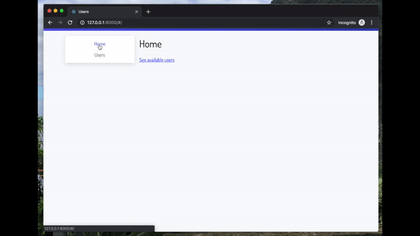

# Homework

## Task

Create a single page application for desktop and mobile users to browse userbase profiles using data available on [this API endpoint](https://jsonplaceholder.typicode.com/users). The application should at least cover the following functionalities:
  - list all users available, and,
  - display a detailed view for a particular user.

Here is a small example of what this could look like:

[](./home-test.mp4)


## Boilerplate code

This repository provides some boilerplate code to help you get started. It was bootstrapped with [Create React App](https://github.com/facebook/create-react-app).

It provides the default scripts:
```shell
    npm start
    npm test
    npm run build
    npm run eject
    npm run build
```

Please feel free to set up your project the way you like if something else works best for you!


🕑 _**Note:** We are not expecting you to spend more than 2 or 3 hours on this assignment._
